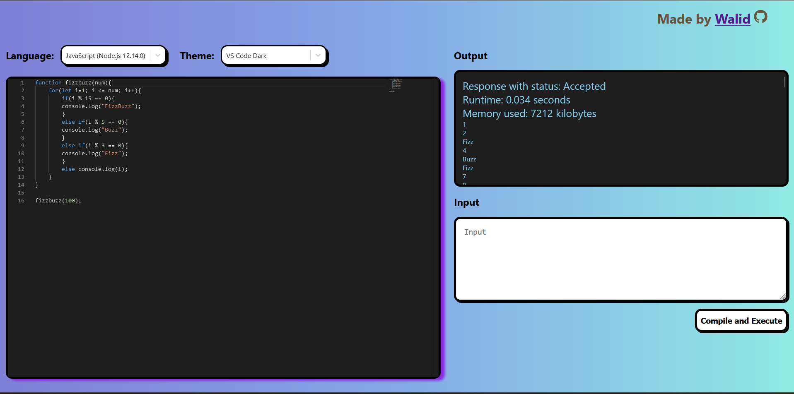

# Code Editor

Building a single page code editor that can compile and execute code in mutliple languages using the [Judge0 API](https://rapidapi.com/judge0-official/api/judge0-ce).

The code editor also supports markdown editing with an automatic preview.

## Live demo

This project was deployed using [Vercel](https://vercel.com/) and is available [live here](https://code-editor-mysticboi.vercel.app/) . 

The project is limited to 100 API calls to the Judge0 API per day

## Techologies used

- ***React***: the famous frontend library. Bootstrapped with [Create React App](https://github.com/facebook/create-react-app).
- ***TypeScript***: A better typed version of JavaScript.
- ***Redux toolkit***: For general state management
- ***Sass***: CSS with superpowers for styling
- ***Axios***: client for API calls

## Running locally

To be able to run this project locally you need an API key for the Judge0 AP. 
To do so go to [RapidAPI](https://rapidapi.com/judge0-official/api/judge0-ce) and subscribe to the Judge0 API for free. 

You then get a `X-RapidAPI-Key` that you add in the file `src/apikey.json` instead of the empty string `""`.

## Available Scripts

In the project directory, you can run:

### `npm install`
To install all node modules. This script should be run first before using the following scripts.

### `npm start`

Runs the app in the development mode.\
Open [http://localhost:3000](http://localhost:3000) to view it in the browser.
### `npm test`

Launches the test runner in the interactive watch mode.\
See the section about [running tests](https://facebook.github.io/create-react-app/docs/running-tests) for more information.

### `npm run build`

Builds the app for production to the `build` folder.\
It correctly bundles React in production mode and optimizes the build for the best performance.

The build is minified and the filenames include the hashes.\
Your app is ready to be deployed!

See the section about [deployment](https://facebook.github.io/create-react-app/docs/deployment) for more information.
